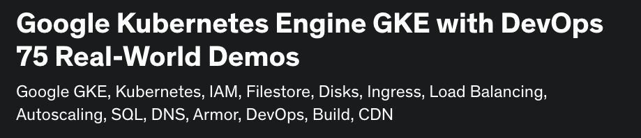

# [GCP GKE Google Kubernetes Engine DevOps 75 Real-World Demos](https://links.stacksimplify.com/gcp-google-kubernetes-engine-gke-with-devops)

## Course Modules
01. Google Cloud Account Creation
02. Create GKE Standard Public Cluster				
03. Install gcloud CLI on mac OS				
04. Install gcloud CLI on Windows OS				
05. Docker Fundamentals				
06. Kubernetes Pods				
07. Kubernetes ReplicaSets				
08. Kubernetes Deployment - CREATE				
09. Kubernetes Deployment - UPDATE				
10. Kubernetes Deployment - ROLLBACK				
11. Kubernetes Deployments - Pause and Resume				
12. Kubernetes ClusterIP and Load Balancer Service				
13. YAML Basics				
14. Kubernetes Pod  & Service using YAML				
15. Kubernetes ReplicaSets using YAML				
16. Kubernetes Deployment using YAML				
17. Kubernetes Services using YAML				
18.  GKE Kubernetes NodePort Service				
19. GKE Kubernetes Headless Service				
20. GKE Private Cluster				
21. How to use GCP Persistent Disks in GKE ?				
22. How to use Balanced Persistent Disk in GKE ?				
23. How to use Custom Storage Class in GKE for Persistent Disks ?				
24. How to use Pre-existing Persistent Disks in GKE ?				
25. How to use Regional Persistent Disks in GKE ?				
26. How to perform Persistent Disk  Volume Snapshots and Volume Restore ?				
28. GKE Workloads and Cloud SQL with Public IP				
29. GKE Workloads and Cloud SQL with Private IP				
30. GKE Workloads and Cloud SQL with Private IP and No ExternalName Service				
31. How to use Google Cloud File Store in GKE ?				
32. How to use Custom Storage Class for File Store in GKE ?				
33. How to perform File Store Instance Volume Snapshots and Volume Restore ?				
34. Ingress Service Basics				
35. Ingress Context Path based Routing				
36. Ingress Custom Health Checks using Readiness Probes				
37. Register a Google Cloud Domain for some advanced Ingress Service Demos 				
38. Ingress with Static External IP and Cloud DNS				
39. Google Managed SSL Certificates for Ingress				
40. Ingress HTTP to HTTPS Redirect				
41. GKE Workload Identity				
42. External DNS Controller Install				
43. External DNS - Ingress Service				
44. External DNS - Kubernetes Service				
45. Ingress Name based Virtual Host Routing				
46. Ingress SSL Policy				
47. Ingress with Identity-Aware Proxy				
48. Ingress with Self Signed SSL Certificates				
49. Ingress with Pre-shared SSL Certificates				
50. Ingress with Cloud CDN, HTTP Access Logging and Timeouts				
51. Ingress with Client IP Affinity				
52. Ingress with Cookie Affinity				
53. Ingress with Custom Health Checks using BackendConfig CRD				
54. Ingress Internal Load Balancer				
55. Ingress with Google Cloud Armor				
56. Google Artifact Registry				
57. GKE Continuous Integration				
58. GKE Continuous Delivery				
59. Kubernetes Liveness Probes				
60. Kubernetes Startup Probes				
61. Kubernetes Readiness Probe				
62. Kubernetes Requests and Limits				
63. GKE Cluster Autoscaling				
64. Kubernetes Namespaces				
65. Kubernetes Namespaces Resource Quota				
66. Kubernetes Namespaces Limit Range				
67. Kubernetes Horizontal Pod Autoscaler				
68. GKE Autopilot Cluster				
69. How to manage Multiple Cluster access in kubeconfig ?				
	

## Kubernetes Concepts Covered
01. Kubernetes Deployments (Create, Update, Rollback, Pause, Resume)
02. Kubernetes Pods
03. Kubernetes Service of Type LoadBalancer
04. Kubernetes Service of Type ClusterIP
05. Kubernetes Ingress Service
06. Kubernetes Storage Class
07. Kubernetes Storage Persistent Volume
08. Kubernetes Storage Persistent Volume Claim
09. Kubernetes Cluster Autoscaler
10. Kubernetes Horizontal Pod Autoscaler
11. Kubernetes Namespaces
12. Kubernetes Namespaces Resource Quota
13. Kubernetes Namespaces Limit Range
14. Kubernetes Service Accounts
15. Kubernetes ConfigMaps
16. Kubernetes Requests and Limits
17. Kubernetes Worker Nodes
18. Kubernetes Service of Type NodePort
19. Kubernetes Service of Type Headless
20. Kubernetes ReplicaSets

## Google Services Covered
01. Google GKE Standard Cluster
02. Google GKE Autopilot Cluster
03. Compute Engine - Virtual Machines
04. Compute Engine - Storage Disks
05. Compute Engine - Storage Snapshots
06. Compute Engine - Storage Images
07. Compute Engine - Instance Groups
08. Compute Engine - Health Checks
09. Compute Engine - Network Endpoint Groups
10. VPC Networks - VPC
11. VPC Network - External and Internal IP Addresses
12. VPC Network - Firewall
13. Network Services - Load Balancing
14. Network Services - Cloud DNS
15. Network Services - Cloud CDN
16. Network Services - Cloud NAT
17. Network Services - Cloud Domains
18. Network Services - Private Service Connection
19. Network Security - Cloud Armor
20. Network Security - SSL Policies
21. IAM & Admin - IAM
22. IAM & Admin - Service Accounts
23. IAM & Admin - Roles
24. IAM & Admin - Identity-Aware Proxy
25. DevOps - Cloud Source Repositories
26. DevOps - Cloud Build
27. DevOps - Cloud Storage
28. SQL - Cloud SQL
29. Storage - Filestore
30. Google Artifact Registry
31. Operations Logging
32. GCP Monitoring

## What will students learn in your course?
- You will learn to master Kubernetes on Google GKE with 75 Real-world  demo's on Google Cloud Platform with 20+ Kubernetes and 30+ Google Cloud Services
- You will learn Kubernetes Basics for 4.5 hours
- You will create GKE Standard and Autopilot clusters with public and private networks
- You will learn to implement Kubernetes Storage with Google Persistent Disks and Google File Store
- You will also use Google Cloud SQL, Cloud Load Balancing to deploy a sample application outlining LB to DB usecase in GKE Cluster
- You will master Kubernetes Ingress concepts in detail on GKE with 22 Real-world Demos
- You will implement Ingress Context Path Routing and Name based vhost routing
- You will implement Ingress with Google Managed SSL Certificates
- You will master Google GKE Workload Identity with a detailed dedicated demo.
- You will implement External DNS Controller to automatically add, delete DNS records automatically in Google Cloud DNS Service
- You will implement Ingress with Preshared SSL and Self Signed Certificates
- You will implement Ingress with Cloud CDN, Cloud Armor, Internal Load Balancer, Cookie Affinity, IP Affinity, HTTP Access Logging.
- You will implement Ingress with Google Identity-Aware Proxy
- You will learn to use Google Artifact Registry with GKE
- You will implement DevOps Continuous Integration (CI) and Continuous Delivery (CD) with Cloud Build and Cloud Source Services
- You will learn to master Kubernetes Probes (Readiness, Startup, Liveness)
- You will implement Kubernetes Requests, Limits, Namespaces, Resource Quota and Limit Range
- You will implement GKE Cluster Autoscaler and Horizontal Pod Autoscaler

## What are the requirements or prerequisites for taking your course?
- You must have an Google Cloud account to follow with me for hands-on activities.
- You don't need to have any basic knowledge of Kubernetes. Course will get started from very very basics of Kubernetes and take you to very advanced levels
- Any Cloud Platform basics is required to understand the terminology

## Who is this course for?
- Infrastructure Architects or Sysadmins or Developers who are planning to master Kubernetes from Real-World perspective on Google Cloud Platform (GCP)
- Any beginner who is interested in learning Kubernetes with Google Cloud Platform (GCP) 
- Any beginner who is planning their career in DevOps

## Github Repositories used for this course
- [Terraform on AWS EKS Kubernetes IaC SRE- 50 Real-World Demos](https://github.com/stacksimplify/terraform-on-aws-eks)
- [Course Presentation](https://github.com/stacksimplify/terraform-on-aws-eks/tree/main/course-presentation)
- [Kubernetes Fundamentals](https://github.com/stacksimplify/kubernetes-fundamentals)
- **Important Note:** Please go to these repositories and FORK these repositories and make use of them during the course.

## Each of my courses come with
- Amazing Hands-on Step By Step Learning Experiences
- Real Implementation Experience
- Friendly Support in the Q&A section
- "30-Day "No Questions Asked" Money Back Guaranteed by Udemy"

## My Other AWS Courses
- [Udemy Enroll](https://www.stacksimplify.com/azure-aks/courses/stacksimplify-best-selling-courses-on-udemy/)

## Stack Simplify Udemy Profile
- [Udemy Profile](https://www.udemy.com/user/kalyan-reddy-9/)

# HashiCorp Certified: Terraform Associate - 50 Practical Demos
 

# AWS EKS - Elastic Kubernetes Service - Masterclass

# Azure Kubernetes Service with Azure DevOps and Terraform 

# Terraform on AWS with SRE & IaC DevOps | Real-World 20 Demos

# Azure - HashiCorp Certified: Terraform Associate - 70 Demos

# Terraform on Azure with IaC DevOps and SRE | Real-World 25 Demos

# [Terraform on AWS EKS Kubernetes IaC SRE- 50 Real-World Demos](https://links.stacksimplify.com/terraform-on-aws-eks-kubernetes-iac-sre)

